# 🗄️ Modelo de Dados (ERD)

Especificação completa do schema do banco (PostgreSQL via Prisma) — toda entidade, campo, tipo, relação, comportamento de exclusão (`onDelete`), índice e enum. É o arquivo que falta para alguém recriar as migrations do zero, sem precisar adivinhar tipo de coluna ou comportamento de FK. Complementa o [MAPEAMENTO_ROTAS.md](./MAPEAMENTO_ROTAS.md) (contrato HTTP) e o [REGRAS_NEGOCIO.md](./REGRAS_NEGOCIO.md) (regras que dependem deste modelo).

## 📌 Índice

- [Convenções gerais do schema](#-convenções-gerais-do-schema)
- [Diagrama de entidades e relacionamentos](#-diagrama-de-entidades-e-relacionamentos)
- [Enums](#-enums)
- [Domínio: Identidade e Acesso](#-domínio-identidade-e-acesso)
- [Domínio: RH e Ponto](#-domínio-rh-e-ponto)
- [Domínio: Documentos de RH](#-domínio-documentos-de-rh)
- [Domínio: Estacionamento (operação)](#-domínio-estacionamento-operação)
- [Domínio: Analytics](#-domínio-analytics)
- [Índices — por que cada um existe](#-índices--por-que-cada-um-existe)
- [Comportamento de exclusão (onDelete) — resumo](#-comportamento-de-exclusão-ondelete--resumo)

---

## ⚙️ Convenções gerais do schema

- **ORM**: Prisma 7, `generator client` com `output = "../generated/prisma"` (cliente gerado fora de `node_modules`, via `@prisma/adapter-pg`).
- **Banco**: PostgreSQL (`provider = "postgresql"`).
- **Chave primária**: todo model usa `id String @id @default(cuid())` — nunca inteiro autoincremento.
- **Nome de tabela**: todo model tem `@@map("nome_em_snake_case_plural")` — o nome da tabela no Postgres é diferente do nome do model no Prisma/TypeScript (ex.: model `Usuario` → tabela `usuarios`).
- **Timestamps**: `criadoEm DateTime @default(now())` em praticamente todo model; `atualizadoEm DateTime @updatedAt` só nos que sofrem edição de fato (`PerfilRH`, `EtapaCarreira`, `ItemPdi`).
- **Valores monetários**: sempre `Decimal @db.Decimal(10, 2)` (ou `(6, 2)` para horas) — nunca `Float`, para evitar erro de arredondamento em dinheiro.
- **Datas "sem hora"** (dia de ponto, dia de férias, dia do caixa): `DateTime @db.Date` — armazenam só a data, a hora é sempre meia-noite.
- **Anexos/imagens**: nunca há upload para storage externo (S3, etc.) — tudo é guardado como **data URI base64 em coluna de texto** (`Usuario.avatar`, `Mensalidade.comprovanteAnexo`, `AssinaturaEletronica.imagemDataUri`). Não há tabela de arquivos nem bucket.

---

## 🕸️ Diagrama de entidades e relacionamentos

```mermaid
erDiagram
    Usuario ||--o| PerfilRH : "tem"
    Usuario ||--o| AssinaturaEletronica : "tem"
    Usuario ||--o{ RegistroPonto : "bate"
    Usuario ||--o{ SolicitacaoTrabalhoExtra : "solicita"
    Usuario ||--o{ SolicitacaoFerias : "solicita"
    Usuario ||--o{ JustificativaPonto : "recebe"
    Usuario ||--o{ Notificacao : "recebe"
    Usuario ||--o{ FolhaPontoMensal : "possui"
    Usuario ||--o{ Holerite : "possui"
    Usuario ||--o{ ContratoTrabalho : "possui"
    Usuario ||--o{ ItemPdi : "possui"
    Usuario ||--o{ LogAuditoria : "gera"
    Usuario ||--o{ ResetSenhaCodigo : "solicita"
    Usuario ||--o{ Ticket : "atende (opcional)"
    Usuario ||--o{ CaixaDiario : "abre/fecha"
    Usuario ||--o{ Mensalidade : "altera (opcional)"
    Usuario |o--o{ PerfilRH : "é gestor de (opcional)"

    PerfilRH }o--|| EtapaCarreira : "está em (opcional)"

    Mensalista ||--o{ Ticket : "possui"
    Mensalista ||--o{ Mensalidade : "gera"

    Vaga ||--o{ Ticket : "recebe"
    Tarifa |o--o{ Ticket : "precifica (opcional)"

    FolhaPontoMensal ||--o{ Notificacao : "referencia (opcional)"
    Holerite ||--o{ Notificacao : "referencia (opcional)"
    ContratoTrabalho ||--o{ Notificacao : "referencia (opcional)"
```

> Diagrama simplificado — não repete que quase toda FK para `Usuario` também guarda "quem gerou/aprovou/decidiu" (ex.: `PerfilRH.gestorId`, `FolhaPontoMensal.geradoPorId`, `SolicitacaoFerias.decididoPorId`). Os detalhes exatos de cada relação nomeada estão nas tabelas abaixo.

---

## 🔢 Enums

| Enum | Valores | Usado em |
|---|---|---|
| `Papel` | `admin`, `funcionario`, `rh`, `gestor`, `financeiro` | `Usuario.role`, `LogAuditoria.papel` |
| `Provedor` | `local`, `google` | `Usuario.provedor` |
| `TipoContrato` | `clt`, `pj` | `PerfilRH.tipoContrato`, `ContratoTrabalho.tipoContrato` |
| `TipoValeTransporte` | `vale_transporte`, `vale_combustivel`, `nenhum` | `PerfilRH.tipoValeTransporte`, `ContratoTrabalho.tipoValeTransporte` |
| `TipoVaga` | `comum`, `coberta`, `mensalista` | `Vaga.tipo` |
| `StatusVaga` | `livre`, `ocupada`, `manutencao` | `Vaga.status` |
| `StatusTicket` | `aberto`, `fechado` | `Ticket.status` |
| `StatusCaixa` | `aberto`, `fechado` | `CaixaDiario.status` |
| `StatusMensalidade` | `pendente`, `paga`, `cancelada` | `Mensalidade.status` |
| `StatusItemPdi` | `pendente`, `concluido` | `ItemPdi.status` |
| `StatusSolicitacaoExtra` | `pendente`, `aprovada`, `rejeitada` | `SolicitacaoTrabalhoExtra.status` |
| `TipoJustificativaPonto` | `atestado`, `abono`, `folga` | `JustificativaPonto.tipo` |
| `StatusFerias` | `pendente`, `aprovada`, `rejeitada` | `SolicitacaoFerias.status` |
| `TipoNotificacao` | `folha_ponto`, `holerite`, `ferias`, `geral`, `contrato` | `Notificacao.tipo` |
| `StatusDocumentoAssinatura` | `pendente_assinatura`, `assinado` | `FolhaPontoMensal.status`, `ContratoTrabalho.status` |
| `StatusHolerite` | `gerado`, `assinado`, `pago` | `Holerite.status` |

---

## 🔑 Domínio: Identidade e Acesso

### `Usuario` (tabela `usuarios`)

| Campo | Tipo | Obrigatório | Observação |
|---|---|---|---|
| `id` | String (cuid) | ✅ | PK |
| `nome` | String | ✅ | |
| `cpf` | String | opcional, **único** | nulo até o usuário (ex.: via Google) completar o cadastro |
| `email` | String | ✅ **único** | usado só para reset de senha e comunicação — **login é por CPF** |
| `senha` | String | opcional | hash bcrypt; nulo para contas Google sem senha local |
| `telefone`, `endereco` | String | opcionais | |
| `dataNascimento` | DateTime | opcional | |
| `avatar` | String | opcional | data URI base64 |
| `role` | `Papel` | default `funcionario` | |
| `ativo` | Boolean | default `true` | conta inativa não consegue logar |
| `aceitouTermos` | Boolean | default `false` | |
| `provedor` | `Provedor` | default `local` | |
| `senhaTemporaria` | Boolean | default `false` | `true` quando um admin reseta a senha de outra pessoa |
| `senhaAlteradaEm` | DateTime | opcional | |
| `criadoEm` | DateTime | default `now()` | |

Relações nomeadas de `Usuario` (todas 1:N a partir de `Usuario`, exceto onde indicado):
`resetSenhaCodigos`, `mensalidadesAlteradas`, `logsAuditoria`, `perfilRH` (1:1), `assinaturaEletronica` (1:1), `registrosPonto`, `solicitacoesExtra`/`extrasAprovadas`, `justificativas`/`justificativasCriadas`, `feriasSolicitadas`/`feriasDecididas`, `notificacoes`, `espelhosPonto`/`espelhosGerados`, `holerites`/`holeritesGerados`, `ticketsAtendidos`, `caixasAbertos`/`caixasFechados`, `itensPdi`/`itensPdiCriados`, `subordinadosRH` (usuários que este usuário gerencia, via `PerfilRH.gestorId`), `contratosTrabalho`/`contratosTrabalhoGerados`.

### `AssinaturaEletronica` (tabela `assinaturas_eletronicas`)

| Campo | Tipo | Observação |
|---|---|---|
| `id` | String (cuid) | PK |
| `usuarioId` | String | **único** (1:1 com Usuario) |
| `imagemDataUri` | String `@db.Text` | assinatura desenhada, base64 |
| `criadoEm` | DateTime | |

### `ResetSenhaCodigo` (tabela `reset_senha_codigos`)

| Campo | Tipo | Observação |
|---|---|---|
| `id` | String (cuid) | PK |
| `usuarioId` | String | FK → Usuario |
| `codigoHash` | String | hash SHA-256 do código de 6 dígitos, nunca texto puro |
| `expiraEm` | DateTime | TTL de 15 minutos a partir da criação |
| `usado` | Boolean | default `false`, uso único |
| `criadoEm` | DateTime | |

### `LogAuditoria` (tabela `logs_auditoria`)

| Campo | Tipo | Observação |
|---|---|---|
| `id` | String (cuid) | PK |
| `usuarioId` | String | FK → Usuario (quem executou a ação) |
| `papel` | `Papel` | papel do usuário **no momento da ação** (não é lido ao vivo depois) |
| `acao` | String | ex.: `perfil-rh.editar`, `ferias.decidir` |
| `entidade` | String | nome lógico da entidade afetada |
| `entidadeId` | String | id do registro afetado |
| `dadosAntes` | Json | opcional — snapshot antes da mudança |
| `dadosDepois` | Json | opcional — snapshot depois da mudança |
| `criadoEm` | DateTime | |

Índices: `[entidade, entidadeId]` e `[usuarioId, criadoEm]`.

---

## 👔 Domínio: RH e Ponto

### `PerfilRH` (tabela `perfis_rh`)

| Campo | Tipo | Observação |
|---|---|---|
| `id` | String (cuid) | PK |
| `usuarioId` | String | **único** (1:1 com Usuario) |
| `cargo` | String | |
| `salarioBase` | Decimal(10,2) | |
| `tipoContrato` | `TipoContrato` | default `clt` |
| `dataAdmissao` | DateTime | |
| `dataDemissao` | DateTime | opcional |
| `diasEscala` | Int[] | exatamente 4 inteiros únicos entre 0–6 (validado no DTO) |
| `horasPorDia` | Int | default `6` |
| `horaInicioEscala` | String | default `"08:00"`, formato livre `HH:mm` |
| `bancoNome`, `agencia`, `contaBancaria` | String | dados bancários sempre simulados |
| `direitos`, `deveres`, `tarefas` | String `@db.Text` | opcionais, texto livre (uma linha por item) |
| `tipoValeTransporte` | `TipoValeTransporte` | default `nenhum` |
| `bonusDesempenho` | Decimal(10,2) | opcional |
| `observacoesBeneficios` | String `@db.Text` | opcional |
| `vagaOrigem` | String `@db.Text` | opcional — texto livre, não é FK para `Vaga` (domínios diferentes) |
| `gestorId` | String | opcional, FK → Usuario, **`onDelete: SetNull`** |
| `etapaCarreiraAtualId` | String | opcional, FK → EtapaCarreira, `onDelete` padrão (`Restrict`) |
| `criadoEm`, `atualizadoEm` | DateTime | |

### `EtapaCarreira` (tabela `etapas_carreira`)

| Campo | Tipo | Observação |
|---|---|---|
| `id` | String (cuid) | PK |
| `ordem` | Int | **único** |
| `titulo` | String | |
| `faixaSalarial` | String | opcional |
| `descricao` | String `@db.Text` | |
| `criadoEm`, `atualizadoEm` | DateTime | |

### `ItemPdi` (tabela `itens_pdi`)

| Campo | Tipo | Observação |
|---|---|---|
| `id` | String (cuid) | PK |
| `usuarioId` | String | FK → Usuario |
| `ordem` | Int | posição na timeline |
| `titulo` | String | |
| `descricao` | String `@db.Text` | opcional |
| `status` | `StatusItemPdi` | default `pendente` |
| `concluidoEm` | DateTime | opcional |
| `criadoPorId` | String | FK → Usuario (sempre RH/admin) |
| `criadoEm`, `atualizadoEm` | DateTime | |

Constraint: **`@@unique([usuarioId, ordem])`** + índice `[usuarioId]`.

### `RegistroPonto` (tabela `registros_ponto`)

| Campo | Tipo | Observação |
|---|---|---|
| `id` | String (cuid) | PK |
| `usuarioId` | String | FK → Usuario |
| `data` | DateTime `@db.Date` | dia do registro |
| `horaEntrada`, `horaSaida` | DateTime | opcionais até serem batidos |
| `criadoEm` | DateTime | |

Constraint: **`@@unique([usuarioId, data])`** — um registro por dia por usuário.

### `SolicitacaoTrabalhoExtra` (tabela `solicitacoes_trabalho_extra`)

| Campo | Tipo | Observação |
|---|---|---|
| `id` | String (cuid) | PK |
| `usuarioId` | String | FK → Usuario |
| `data` | DateTime `@db.Date` | |
| `motivo` | String | |
| `status` | `StatusSolicitacaoExtra` | default `pendente` |
| `aprovadoPorId` | String | opcional, FK → Usuario |
| `aprovadoEm` | DateTime | opcional |
| `criadoEm` | DateTime | |

Constraint: **`@@unique([usuarioId, data])`**.

### `JustificativaPonto` (tabela `justificativas_ponto`)

| Campo | Tipo | Observação |
|---|---|---|
| `id` | String (cuid) | PK |
| `usuarioId` | String | FK → Usuario (quem foi justificado) |
| `data` | DateTime `@db.Date` | |
| `tipo` | `TipoJustificativaPonto` | |
| `descricao` | String | opcional |
| `criadoPorId` | String | FK → Usuario (sempre RH/admin) |
| `criadoEm` | DateTime | |

Constraint: **`@@unique([usuarioId, data])`**.

### `SolicitacaoFerias` (tabela `solicitacoes_ferias`)

| Campo | Tipo | Observação |
|---|---|---|
| `id` | String (cuid) | PK |
| `usuarioId` | String | FK → Usuario |
| `dataInicio`, `dataFim` | DateTime `@db.Date` | |
| `dias` | Int | contagem inclusiva |
| `status` | `StatusFerias` | default `pendente` |
| `decididoPorId` | String | opcional, FK → Usuario |
| `decididoEm` | DateTime | opcional |
| `criadoEm` | DateTime | |

Índice: `[usuarioId]`.

### `Notificacao` (tabela `notificacoes`)

| Campo | Tipo | Observação |
|---|---|---|
| `id` | String (cuid) | PK |
| `usuarioId` | String | FK → Usuario (destinatário) |
| `tipo` | `TipoNotificacao` | |
| `titulo`, `mensagem` | String | |
| `folhaPontoId` | String | opcional, FK → FolhaPontoMensal |
| `holeriteId` | String | opcional, FK → Holerite |
| `contratoId` | String | opcional, FK → ContratoTrabalho |
| `lida` | Boolean | default `false` |
| `lidaEm` | DateTime | opcional |
| `criadoEm` | DateTime | |

Índice: `[usuarioId, lida]`.

---

## 📄 Domínio: Documentos de RH

### `FolhaPontoMensal` (tabela `folhas_ponto_mensais`) — Espelho de Ponto

| Campo | Tipo | Observação |
|---|---|---|
| `id` | String (cuid) | PK |
| `usuarioId` | String | FK → Usuario |
| `referencia` | String | `"YYYY-MM"` |
| `horasNormais`, `horasExtras`, `horasForaEscala` | Decimal(6,2) | |
| `faltas` | Int | |
| `status` | `StatusDocumentoAssinatura` | default `pendente_assinatura` |
| `geradoPorId` | String | FK → Usuario |
| `geradoEm` | DateTime | |
| `assinadoEm` | DateTime | opcional |

Constraint: **`@@unique([usuarioId, referencia])`**.

### `Holerite` (tabela `holerites`)

| Campo | Tipo | Observação |
|---|---|---|
| `id` | String (cuid) | PK |
| `usuarioId` | String | FK → Usuario |
| `referencia` | String | `"YYYY-MM"` |
| `salarioProporcional`, `valorHorasExtras`, `valorHorasForaEscala`, `valorVr`, `valorVa`, `inss`, `irrf`, `salarioLiquido` | Decimal(10,2) | valores já calculados e congelados |
| `status` | `StatusHolerite` | default `gerado` |
| `geradoPorId` | String | FK → Usuario |
| `geradoEm` | DateTime | |
| `assinadoEm`, `pagoEm` | DateTime | opcionais |

Constraint: **`@@unique([usuarioId, referencia])`**.

### `ContratoTrabalho` (tabela `contratos_trabalho`)

| Campo | Tipo | Observação |
|---|---|---|
| `id` | String (cuid) | PK |
| `usuarioId` | String | FK → Usuario |
| `numeroVersao` | Int | sequencial por usuário, calculado no service |
| `cargo` | String | cópia congelada do PerfilRH no momento da geração |
| `vagaOrigem` | String `@db.Text` | opcional |
| `tipoContrato` | `TipoContrato` | |
| `dataAdmissao` | DateTime | |
| `diasEscala` | Int[] | |
| `horasPorDia` | Int | |
| `horaInicioEscala` | String | |
| `salarioBase` | Decimal(10,2) | |
| `tipoValeTransporte` | `TipoValeTransporte` | |
| `bonusDesempenho` | Decimal(10,2) | opcional |
| `observacoesBeneficios`, `direitos`, `deveres`, `tarefas` | String `@db.Text` | opcionais |
| `nomeGestorNoMomento`, `cargoGestorNoMomento` | String | opcionais — cópia congelada, não FK |
| `status` | `StatusDocumentoAssinatura` | default `pendente_assinatura` |
| `geradoPorId` | String | FK → Usuario |
| `geradoEm` | DateTime | |
| `assinadoEm` | DateTime | opcional |

Constraint: **`@@unique([usuarioId, numeroVersao])`**.

---

## 🅿️ Domínio: Estacionamento (operação)

### `Mensalista` (tabela `mensalistas`)

| Campo | Tipo | Observação |
|---|---|---|
| `id` | String (cuid) | PK |
| `nome` | String | |
| `cpf` | String | **único** |
| `placa` | String | **único** |
| `telefone` | String | obrigatório |
| `email` | String | opcional — necessário só para lembrete por e-mail |
| `valorMensalidade` | Decimal(10,2) | default `0` |
| `categoriaPlano` | String | default `"Mensal Integral"` — texto livre, não enum (evita migration a cada novo plano) |
| `ativo` | Boolean | default `true` |
| `criadoEm` | DateTime | |

### `Mensalidade` (tabela `mensalidades`) — um ciclo de 30 dias

| Campo | Tipo | Observação |
|---|---|---|
| `id` | String (cuid) | PK |
| `mensalistaId` | String | FK → Mensalista |
| `referencia` | String | `"YYYY-MM"` do início do ciclo |
| `dataInicio`, `dataFim` | DateTime | ciclo sempre de 30 dias corridos |
| `diasCobrados`, `diasNoMes` | Int | sempre `30`/`30` na implementação atual (sem rateio) |
| `valor` | Decimal(10,2) | |
| `status` | `StatusMensalidade` | default `pendente` |
| `formaPagamento` | String | opcional |
| `motivoCancelamento` | String | opcional, só preenchido quando `status = cancelada` |
| `alteradoPorId` | String | opcional, FK → Usuario, **`onDelete: SetNull`** |
| `alteradoEm` | DateTime | opcional |
| `comprovanteAnexo` | String | opcional, data URI base64 |
| `comprovanteNomeArquivo` | String | opcional |
| `criadoEm` | DateTime | |

Constraint: **`@@unique([mensalistaId, referencia])`**.

### `Vaga` (tabela `vagas`)

| Campo | Tipo | Observação |
|---|---|---|
| `id` | String (cuid) | PK |
| `codigo` | String | **único**, normalizado para maiúsculas |
| `tipo` | `TipoVaga` | default `comum` |
| `status` | `StatusVaga` | default `livre` |
| `acessivel` | Boolean | default `false` |

### `Tarifa` (tabela `tarifas`)

| Campo | Tipo | Observação |
|---|---|---|
| `id` | String (cuid) | PK |
| `categoria` | String | texto livre |
| `valorHora` | Decimal(10,2) | |

### `Ticket` (tabela `tickets`)

| Campo | Tipo | Observação |
|---|---|---|
| `id` | String (cuid) | PK |
| `placa` | String | não normalizada por unicidade (pode repetir entre tickets fechados) |
| `status` | `StatusTicket` | default `aberto` |
| `dataEntrada` | DateTime | default `now()` |
| `dataSaida` | DateTime | opcional |
| `valorTotal` | Decimal(10,2) | opcional, calculado no fechamento |
| `formaPagamento` | String | opcional |
| `vagaId` | String | FK → Vaga (obrigatória) |
| `tarifaId` | String | opcional, FK → Tarifa |
| `mensalistaId` | String | opcional, FK → Mensalista |
| `atendidoPorId` | String | opcional, FK → Usuario — quem estava logado ao **fechar** o ticket |

### `CaixaDiario` (tabela `caixas_diarios`)

| Campo | Tipo | Observação |
|---|---|---|
| `id` | String (cuid) | PK |
| `data` | DateTime `@db.Date`, **único** | um caixa por dia corrido |
| `valorAbertura` | Decimal(10,2) | contado manualmente por quem abre |
| `abertoPorId` | String | FK → Usuario |
| `abertoEm` | DateTime | |
| `valorFechamento` | Decimal(10,2) | opcional |
| `valorEsperadoFechamento` | Decimal(10,2) | opcional — recalculado no momento do fechamento |
| `diferenca` | Decimal(10,2) | opcional — `valorFechamento - valorEsperadoFechamento` |
| `fechadoPorId` | String | opcional, FK → Usuario |
| `fechadoEm` | DateTime | opcional |
| `observacoesFechamento` | String | opcional |
| `status` | `StatusCaixa` | default `aberto` |

---

## 📊 Domínio: Analytics

### `EventoUso` (tabela `eventos_uso`)

| Campo | Tipo | Observação |
|---|---|---|
| `id` | String (cuid) | PK |
| `tipo` | String | ex.: `visualizacao`, `tempo-na-tela` |
| `tela` | String | |
| `duracaoMs` | Int | opcional |
| `criadoEm` | DateTime | |

**Deliberadamente sem `usuarioId` nem IP** — anonimato por design (LGPD). Índices: `[tela]`, `[criadoEm]`.

---

## 📇 Índices — por que cada um existe

Além das PKs e `@unique`, o schema declara índices compostos pensados para consultas específicas (documentados como comentário no próprio `schema.prisma`):

| Índice | Tabela | Cobre |
|---|---|---|
| `[entidade, entidadeId]` | `logs_auditoria` | busca de histórico de um registro específico |
| `[usuarioId, criadoEm]` | `logs_auditoria` | histórico de ações de um usuário, ordenado |
| `[usuarioId]` | `itens_pdi` | listar PDI de um usuário |
| `[usuarioId]` | `solicitacoes_ferias` | listar férias de um usuário |
| `[usuarioId, lida]` | `notificacoes` | contagem/lista de não lidas |
| `[mensalistaId, dataFim]` | `mensalidades` | `buscarCicloVigente` (`WHERE mensalistaId = ? AND dataFim >= ?`) |
| `[status, referencia]` | `mensalidades` | KPI "recebido no mês" (`WHERE status = 'paga' AND referencia = ?`) |
| `[status, dataEntrada]` | `tickets` | listagem/filtro por status ordenada por entrada |
| `[placa, status]` | `tickets` | checagem "placa já tem ticket aberto" a cada abertura |
| `[vagaId]` | `tickets` | ranking de vagas / filtro por vaga |
| `[mensalistaId]` | `tickets` | histórico de tickets de um mensalista |
| `[atendidoPorId, status]` | `tickets` | relatório de desempenho por funcionário |
| `[tela]`, `[criadoEm]` | `eventos_uso` | agregações de analytics |

---

## 🔗 Comportamento de exclusão (onDelete) — resumo

O padrão do Prisma quando **não especificado** é `Restrict` (a exclusão do "lado 1" falha se houver registros dependentes). O schema só sobrescreve isso em dois pontos, ambos porque o vínculo é apenas informativo, não estrutural:

| Relação | Comportamento | Por quê |
|---|---|---|
| `PerfilRH.gestorId → Usuario` | **`SetNull`** | desligar/excluir um gestor não pode travar os subordinados — eles só ficam sem gestor até o RH atribuir outro |
| `Mensalidade.alteradoPorId → Usuario` | **`SetNull`** | excluir o usuário que deu baixa numa cobrança não pode impedir a exclusão da conta nem apagar o histórico da cobrança |

Todas as outras FKs usam o padrão **`Restrict`** — inclusive onde isso é usado deliberadamente como trava de integridade, sempre com uma mensagem de erro amigável lançada no service **antes** do banco rejeitar (ver [REGRAS_NEGOCIO.md](./REGRAS_NEGOCIO.md)):

- `Vaga` não pode ser excluída com tickets vinculados (mesmo fechados).
- `Tarifa` não pode ser excluída com ticket **aberto** vinculado (checagem preventiva no service, não só a FK).
- `Mensalista` não pode ser excluído com histórico de `Mensalidade`.
- `EtapaCarreira` não pode ser excluída se algum `PerfilRH` a referencia.
